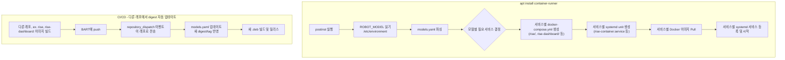
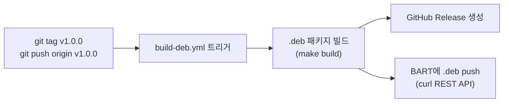
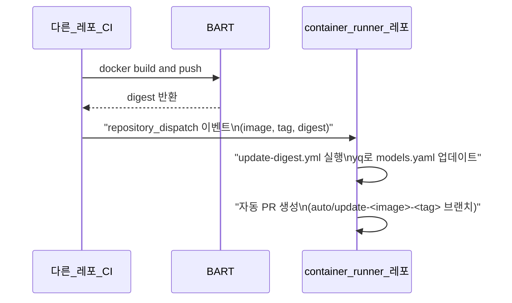

# container-runner

## Overview

Debian package (`container-runner.deb`) that manages Docker container services on Samsung Humanoid robots. When installed via `apt`, it reads the robot's `ROBOT_MODEL` from `/etc/environment`, pulls the correct Docker images from BART registry, and runs them as systemd-managed services via Docker Compose.

## Architecture



## Features

- **Model-based service selection**: Automatically determines which services (rise, rise-dashboard 등) to run based on `ROBOT_MODEL`. Extensible to new services (e.g. whole-body-controller)
- **Per-service systemd management**: Each service gets its own systemd unit (`<service>-container.service`), independently controllable via `systemctl start/stop/status`
- **Per-model image overrides**: Default image versions with optional per-model tag/digest overrides
- **Automated digest updates**: Other repos trigger `repository_dispatch` to update image digests in CI
- **Reusable BART push workflow**: Shared workflow for building and pushing Docker images to BART registry

## Directory Structure

```
container-runner/
├── config/
│   └── models.yaml                      # 로봇 모델 → 이미지/서비스 매핑
├── compose/
│   ├── rise.yml                         # rise 서비스 compose fragment
│   └── rise-dashboard.yml               # rise-dashboard 서비스 compose fragment
│   # 새 서비스 추가 시 <service-name>.yml 파일을 여기에 추가
├── scripts/
│   ├── generate_config.py               # 서비스별 docker-compose.yml, .env, systemd unit 생성
│   ├── setup.sh                         # 메인 설정 스크립트 (postinst에서 호출)
│   └── teardown.sh                      # 정리 스크립트 (prerm에서 호출)
├── debian/
│   ├── control                          # 패키지 메타데이터 (Depends: docker-ce, python3-yaml)
│   ├── changelog
│   ├── rules
│   ├── compat
│   ├── conffiles                        # Config files preserved on upgrade
│   ├── install                          # 파일 설치 매핑
│   ├── postinst                         # 설치 후 스크립트 → setup.sh 호출
│   ├── prerm                            # 제거 전 스크립트 → teardown.sh 호출
│   └── postrm                           # 제거 후 정리
├── .github/workflows/
│   ├── build-deb.yml                    # .deb 패키지 빌드 워크플로우
│   ├── update-digest.yml                # 다른 레포에서 트리거 - digest 업데이트
│   ├── release_docker_image.yml         # Reusable BART push workflow (기존)
│   └── pre-commit.yaml                  # Pre-commit checks (기존)
├── Makefile                             # dpkg-deb 빌드 스크립트
└── README.md
```

## Installation

### Prerequisites

- `ROBOT_MODEL` must be set in `/etc/environment` on the target robot
- Docker (`docker-ce`) and Docker Compose plugin installed
- Python 3.8+ with `python3-yaml` installed
- Network access to the BART registry

### Install the package

```bash
sudo apt install ./container-runner_<version>_all.deb
```

The post-install script will automatically:

1. Read `ROBOT_MODEL` from `/etc/environment`
2. Generate per-service `docker-compose.yml`, `.env`, and systemd unit files
3. Pull the required Docker images per service from BART
4. Enable and start each `<service>-container.service` systemd unit

### Verify installation

```bash
# List all container services
systemctl list-units '*-container*'

# Check individual service status
systemctl status rise-container.service
systemctl status rise-dashboard-container.service

# Stop/start/restart individual services
systemctl stop rise-dashboard-container.service
systemctl start rise-dashboard-container.service
systemctl restart rise-container.service

# View running containers per service
docker compose -f /etc/container-runner/rise/docker-compose.yml ps
docker compose -f /etc/container-runner/rise-dashboard/docker-compose.yml ps

# View logs per service
docker compose -f /etc/container-runner/rise/docker-compose.yml logs
```

### Uninstall

```bash
# Remove (keeps config)
sudo apt remove container-runner

# Remove and purge config + images
sudo apt purge container-runner
```

## Package Design Details

### 1. config/models.yaml - 핵심 설정 파일

로봇 모델별 서비스 매핑과 이미지 정보를 하나의 파일로 관리합니다. 로봇 모델별로 이미지 tag/digest가 다를 수 있으므로 `image_overrides`를 지원합니다.

```yaml
bart_registry: "samsung-humanoid-docker-local.bart.sec.samsung.net"

# 기본 이미지 버전 (모든 모델에 적용)
images:
  rise:
    tag: "1.0.0"
    digest: "sha256:abcdef1234567890..."
  rise-dashboard:
    tag: "1.0.0"
    digest: "sha256:1234567890abcdef..."
  # 새 서비스 이미지 추가 예시:
  # whole-body-controller:
  #   tag: "1.0.0"
  #   digest: "sha256:fedcba0987654321..."

# 로봇 모델 설정
models:
  humanoid-power1p2:
    services: [rise]
  humanoid-power1p2:
    services: [rise, rise-dashboard]
    # 모델별 이미지 오버라이드 (선택)
    # image_overrides:
    #   rise:
    #     tag: "1.2.0"
    #     digest: "sha256:override123..."

  # 새 서비스 추가 시 models에 포함하면 됨:
  # humanoid-power1p2:
  #   services: [rise, rise-dashboard, whole-body-controller]
```

### 2. compose/ - Docker Compose 프래그먼트

각 서비스를 개별 compose 파일로 분리합니다. `generate_config.py`가 모델에 필요한 서비스별로 개별 `docker-compose.yml`과 `.env`, systemd unit 파일을 생성합니다.

- `rise.yml`: rise 서비스 (실제 운영 설정 포함)
- `rise-dashboard.yml`: rise-dashboard 서비스 (rise와 동일한 컨테이너 설정, image만 다름)

rise와 rise-dashboard는 동일한 컨테이너 설정(shm_size, privileged, pid: host, iceoryx mounts, security_opt 등)을 공유하며, 이미지만 다릅니다. compose 파일에서 이미지 참조는 환경변수를 사용합니다:

```yaml
# compose/rise.yml (실제 운영 설정)
services:
  rise-container:
    image: "${RISE_IMAGE}"
    shm_size: 15g
    privileged: true
    pid: host
    network_mode: host
    security_opt:
      - seccomp:unconfined
    volumes:
      - /dev:/dev:rw
      - /etc/rise:/etc/rise:rw
      - /etc/iceoryx:/etc/iceoryx:rw
      - /tmp:/tmp:rw
      # ... (iceoryx, logs 등 전체 마운트)
    environment:
      - ROBOT_MODEL=${ROBOT_MODEL}
    restart: unless-stopped
```

**새 서비스 추가 방법 (예: whole-body-controller):**

1. `compose/whole-body-controller.yml` 파일 생성
2. `config/models.yaml`의 `images`에 이미지 정보 추가
3. 해당 모델의 `services` 목록에 `whole-body-controller` 추가
4. `generate_config.py`의 `service_env_map`에 환경변수 매핑 추가 (이미 포함되어 있음)

이렇게 하면 별도 코드 수정 없이 새 서비스를 확장할 수 있습니다.

### 3. 서비스별 systemd unit (동적 생성)

systemd unit 파일은 패키지에 포함되지 않고, `generate_config.py`가 설치 시 서비스별로 동적 생성합니다:

```ini
# 예: /lib/systemd/system/rise-container.service (자동 생성)
[Unit]
Description=Container Runner - rise
After=docker.service network-online.target
Requires=docker.service

[Service]
Type=oneshot
RemainAfterExit=yes
WorkingDirectory=/etc/container-runner/rise
ExecStartPre=/usr/bin/docker compose --env-file /etc/container-runner/rise/.env -f /etc/container-runner/rise/docker-compose.yml pull --quiet
ExecStart=/usr/bin/docker compose --env-file /etc/container-runner/rise/.env -f /etc/container-runner/rise/docker-compose.yml up -d
ExecStop=/usr/bin/docker compose --env-file /etc/container-runner/rise/.env -f /etc/container-runner/rise/docker-compose.yml down
TimeoutStartSec=600
TimeoutStopSec=120

[Install]
WantedBy=multi-user.target
```

### 4. scripts/setup.sh - 핵심 설치 로직

postinst에서 호출되는 메인 스크립트. Python3 (PyYAML)을 사용하여 YAML 파싱:

1. `/etc/environment`에서 `ROBOT_MODEL` 읽기
2. `generate_config.py`로 서비스별 docker-compose.yml, .env, systemd unit 생성
3. 서비스별 `docker compose pull`로 이미지 다운로드
4. 서비스별 `systemctl enable --now <service>-container.service`

### 5. scripts/generate_config.py - 설정 생성 헬퍼

Python 스크립트로 models.yaml을 파싱하고, 서비스별로:

- `<output_dir>/<service>/docker-compose.yml` 생성 (compose fragment 복사)
- `<output_dir>/<service>/.env` 생성 (해당 이미지 참조만 포함)
- `/lib/systemd/system/<service>-container.service` 생성 (systemd unit)
- 모델에서 제거된 기존 서비스는 자동 정리 (unit disable + 파일 삭제)

### 6. debian/ - 패키지 정의

- `control`: `Depends: docker-ce, python3-yaml` 등 의존성 명시
- `postinst`: `scripts/setup.sh` 호출
- `prerm`: 서비스 중지 및 비활성화
- `postrm`: 설정 파일 및 이미지 정리 (purge 시)
- `container-runner.install`: 파일들의 설치 경로 매핑

설치 후 파일 배치:

| Path                                                 | Description                                    |
| ---------------------------------------------------- | ---------------------------------------------- |
| `/etc/container-runner/models.yaml`                  | 설정 파일 (conffile, 업그레이드 시 보존)       |
| `/etc/container-runner/<service>/docker-compose.yml` | 서비스별 compose 파일 (설치 시 자동 생성)      |
| `/etc/container-runner/<service>/.env`               | 서비스별 환경변수 (설치 시 자동 생성)          |
| `/usr/lib/container-runner/compose/`                 | Compose 프래그먼트 템플릿                      |
| `/usr/lib/container-runner/generate_config.py`       | 설정 생성기                                    |
| `/usr/lib/container-runner/setup.sh`                 | 설치 셋업 스크립트                             |
| `/usr/lib/container-runner/teardown.sh`              | 제거 클린업 스크립트                           |
| `/lib/systemd/system/<service>-container.service`    | 서비스별 systemd unit 파일 (설치 시 자동 생성) |

설치 후 디렉터리 구조 예시 (`ROBOT_MODEL=extreme` - rise, rise-dashboard 모두 사용):

```
/etc/container-runner/
├── models.yaml
├── rise/
│   ├── docker-compose.yml
│   └── .env
└── rise-dashboard/
    ├── docker-compose.yml
    └── .env

/lib/systemd/system/
├── rise-container.service
└── rise-dashboard-container.service
```

## CI/CD Workflows

### Required Secrets & Variables

이 레포의 GitHub Settings에 아래 항목들이 등록되어 있어야 합니다.

| 종류     | 이름                     | 설명                                                                                      |
| -------- | ------------------------ | ----------------------------------------------------------------------------------------- |
| Secret   | `SRBOT_BART_CICD`        | BART registry 인증 토큰 (사용자: `srbot`)                                                 |
| Secret   | `SRBOT_GITHUB_CICD`      | GitHub API 토큰 (Release 생성, PR 생성 등)                                                |
| Variable | `SRBOT_DEVIAN_BART_REPO` | BART Debian 저장소 URL (예: `https://samsung-humanoid-docker-local.bart.sec.samsung.net`) |

### Workflow 1: .deb 빌드 및 BART 배포 (`build-deb.yml`)

semver 태그(`v*`)를 push하면 자동으로 실행됩니다.



**실행 방법:**

```bash
# 1. 태그 생성 (semver 형식)
git tag v1.0.0

# 2. 태그 push → 워크플로우 자동 트리거
git push origin v1.0.0
```

**워크플로우가 수행하는 작업:**

1. 소스 checkout 및 태그에서 버전 추출 (`v1.0.0` → `1.0.0`)
2. `debian/control`에 버전 자동 삽입
3. `make build`로 `.deb` 패키지 빌드 (`dpkg-deb --build`)
4. GitHub Artifact로 `.deb` 업로드
5. GitHub Release 생성 및 `.deb`를 릴리스 에셋으로 첨부
6. BART Debian 저장소에 `.deb` push (curl REST API, `srbot` 계정)

**BART push 상세:**

```bash
# build-deb.yml 내부에서 실행되는 curl 명령
curl -f -u "srbot:$SRBOT_BART_CICD" \
  -XPUT \
  "${SRBOT_DEVIAN_BART_REPO}/container-runner_<version>_all.deb;deb.distribution=stable;deb.component=main;deb.architecture=all" \
  -T "build/container-runner_<version>_all.deb"
```

### Workflow 2: 이미지 Digest 자동 업데이트 (`update-digest.yml`)

다른 레포에서 Docker 이미지를 빌드하여 BART에 push한 후, `repository_dispatch` 이벤트를 보내면 이 레포의 `models.yaml`이 자동으로 업데이트됩니다.



**다른 레포의 CI에서 트리거하는 방법:**

이미지를 BART에 push한 후, 아래 `repository_dispatch` API를 호출합니다. `SRBOT_GITHUB_CICD` 토큰이 필요합니다.

```bash
# 다른 레포의 CI workflow에서 호출
curl -X POST \
  -H "Authorization: token ${SRBOT_GITHUB_CICD}" \
  -H "Accept: application/vnd.github.v3+json" \
  https://github.ecodesamsung.com/api/v3/repos/SamsungHumanoid/container-runner/dispatches \
  -d '{
    "event_type": "update-image-digest",
    "client_payload": {
      "image": "rise",
      "tag": "1.1.0",
      "digest": "sha256:newdigest123..."
    }
  }'
```

**client_payload 필드:**

| 필드     | 설명                                                        | 예시                     |
| -------- | ----------------------------------------------------------- | ------------------------ |
| `image`  | 업데이트할 이미지 이름 (`models.yaml`의 `images` 키와 일치) | `rise`, `rise-dashboard` |
| `tag`    | 새 이미지 태그                                              | `1.1.0`                  |
| `digest` | 새 이미지 digest                                            | `sha256:abc123...`       |

**다른 레포 GitHub Actions 워크플로우 예시:**

`release_docker_image.yml` reusable workflow가 이미지 push 후 자동으로 `repository_dispatch`를 container-runner에 보내므로, 호출 레포에서 별도로 dispatch를 보낼 필요가 없습니다. `secrets: inherit`만 사용하면 됩니다.

```yaml
# 다른 레포의 .github/workflows/release.yml
name: Build and Push Docker Image

on:
  push:
    tags:
      - "v*"

jobs:
  push:
    uses: SamsungHumanoid/container-runner/.github/workflows/release_docker_image.yml@main
    with:
      bart_repo: samsung-humanoid-docker-local.bart.sec.samsung.net
    secrets: inherit
```

**트리거 후 동작:**

1. `update-digest.yml` 실행
2. `yq`로 `config/models.yaml`의 해당 이미지 `tag`와 `digest` 업데이트
3. `auto/update-<image>-<tag>` 브랜치에 커밋 후 자동 PR 생성
4. PR 머지 후 태그를 push하면 `build-deb.yml`이 새 `.deb` 빌드 및 BART 배포

### Workflow 3: Reusable BART Docker Push (`release_docker_image.yml`)

다른 레포에서 Docker 이미지를 빌드하여 BART에 push할 때 사용하는 재사용 워크플로우입니다.

```yaml
# 다른 레포에서 호출하는 방법
# release_docker_image.yml이 이미지 push 후 자동으로 container-runner에
# repository_dispatch를 보내므로, 호출 레포에서 별도 dispatch를 보낼 필요 없음.
jobs:
  push:
    uses: SamsungHumanoid/container-runner/.github/workflows/release_docker_image.yml@main
    with:
      bart_repo: samsung-humanoid-docker-local.bart.sec.samsung.net
    secrets: inherit
```

## Building the .deb Package

### 로컬 빌드

로컬 환경(Linux)에서 직접 `.deb`를 빌드하는 방법입니다. `dpkg-deb`가 설치되어 있어야 합니다.

```bash
# 1. 태그 기반 버전 추출 (태그가 없으면 0.1.0 기본값 사용)
make build

# 결과물 확인
ls -la build/container-runner_*.deb
```

**Makefile 동작 흐름:**

1. `build/container-runner/` 디렉터리에 `.deb` 패키지 구조 생성
2. `debian/control`에 git 태그 기반 버전 삽입
3. 설정 파일, compose 프래그먼트, 스크립트 복사 (systemd unit은 설치 시 동적 생성)
4. `dpkg-deb --build`로 최종 `.deb` 패키지 생성

```bash
# 빌드 결과물 구조
build/container-runner/
├── DEBIAN/
│   ├── control          # 패키지 메타데이터 (Version 자동 삽입됨)
│   ├── conffiles
│   ├── postinst
│   ├── prerm
│   └── postrm
├── etc/container-runner/
│   └── models.yaml
├── usr/lib/container-runner/
│   ├── compose/
│   │   ├── rise.yml
│   │   └── rise-dashboard.yml
│   ├── generate_config.py
│   ├── setup.sh
│   └── teardown.sh
# Note: systemd unit 파일은 설치 시 generate_config.py가 서비스별로 동적 생성
```

### CI 빌드 (자동)

위 [Workflow 1](#workflow-1-deb-빌드-및-bart-배포-build-debyml) 참조. semver 태그를 push하면 자동으로 `.deb` 빌드 → GitHub Release → BART push까지 수행됩니다.

```bash
git tag v1.0.0
git push origin v1.0.0
```

### 로봇에 설치

BART에 배포된 `.deb`를 로봇에서 설치합니다.

```bash
# BART에서 직접 다운로드하여 설치
curl -u "srbot:<token>" -O \
  "https://samsung-humanoid-docker-local.bart.sec.samsung.net/container-runner_1.0.0_all.deb"
sudo apt install ./container-runner_1.0.0_all.deb

# 또는 BART apt 저장소가 등록되어 있으면
sudo apt update
sudo apt install container-runner
```

## Design Decisions

| 항목               | 결정                                                          | 이유                                                |
| ------------------ | ------------------------------------------------------------- | --------------------------------------------------- |
| 설정 형식          | YAML (models.yaml)                                            | 사람이 읽기 쉽고, CI에서 자동 수정 용이             |
| Compose 구조       | 서비스별 개별 compose 파일                                    | 서비스별 독립 관리, 개별 start/stop 가능            |
| systemd            | 서비스별 독립 unit (`<service>-container.service`, 동적 생성) | `systemctl stop/start/status` 서비스별 개별 제어    |
| 이미지 참조        | digest 기반 (.env에 주입)                                     | 재현 가능한 배포, tag만으로는 이미지 변경 감지 불가 |
| 모델별 이미지 분기 | image_overrides in models.yaml                                | 기본값 + 모델별 오버라이드로 중복 최소화            |
| Digest 업데이트    | repository_dispatch + auto-PR                                 | 다른 레포에서 push 후 자동 반영                     |

## Repository

JFlog > https://jfrog.com/help/
Docker 저장소 : samsung-humanoid-docker-local.bart.sec.samsung.net
APT 저장소 : samsung-humanoid-debian-remote.bart.sec.samsung.net
