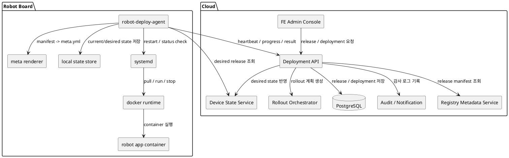
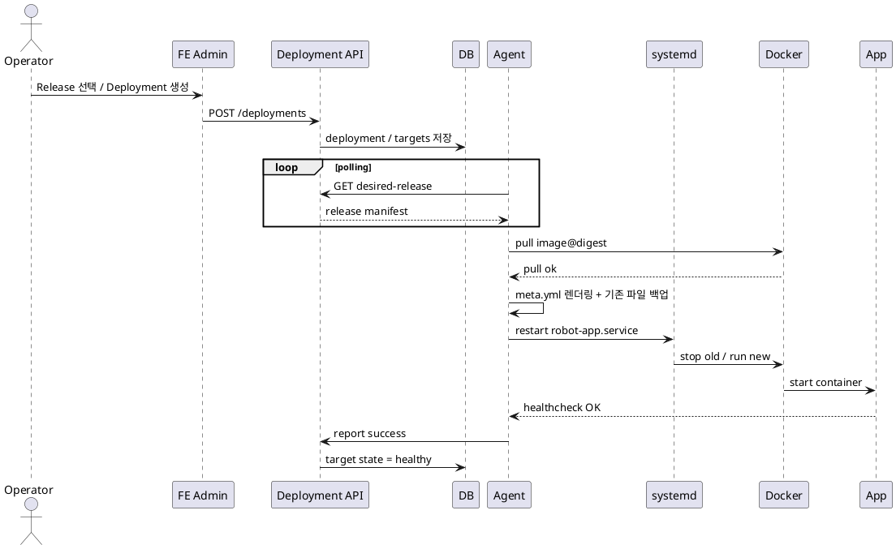
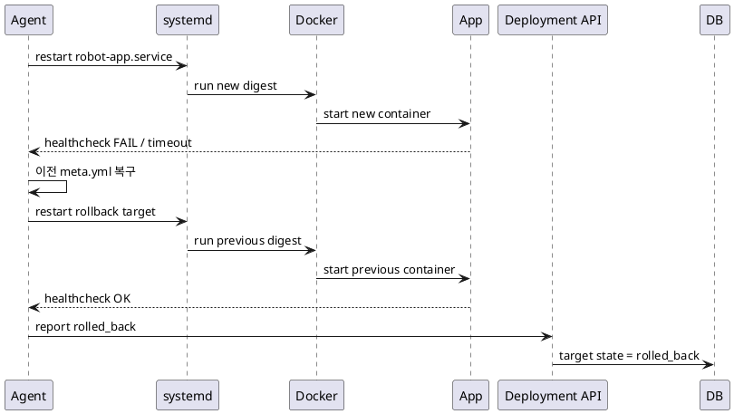

# 로봇 개발보드 자동 배포 아키텍처 설계 초안

## 1. 문서 목적

이 문서는 현재 **`meta.yml` + `systemd` + `docker image digest` 기반 실행 구조**를 유지하면서,
클라우드의 FE/BE와 연동되는 **로봇 개발보드 자동 배포(Control Plane + Agent)** 구조를 설계하기 위한 초안이다.

이 문서는 다음을 목표로 한다.

- 특정 **Docker image digest** 기준으로 정확한 버전 배포
- 클라우드 FE에서 fleet/group/device 단위 배포 제어
- agent를 통한 **desired state / actual state reconciliation**
- healthcheck 기반 배포 성공 판정
- 실패 시 자동 rollback
- 배포 이력, 감사 로그, 상태 가시성 확보
- Claude Code로 실제 구현을 시작할 수 있는 수준의 아키텍처/DB/API/상태머신 정의 제공

---

## 2. 현재 구조 요약

현재 로봇 개발보드는 다음과 같은 형태로 동작한다고 가정한다.

- 로컬 `meta.yml` 파일에 docker image digest가 기록됨
- `systemd` 데몬/서비스가 `meta.yml`을 읽어서 지정 digest 이미지를 pull/run 함
- 따라서 로컬 런타임은 이미 **digest pinning 기반의 재현 가능한 실행 구조**를 어느 정도 갖추고 있음

즉, 새로 필요한 것은 “실행기 자체”보다 **클라우드에서 어떤 digest를 어떤 보드에 언제 배포할지 선언하고, 이를 안전하게 적용/롤백하는 제어 계층**이다.

---

## 3. 핵심 설계 원칙

### 3.1 Tag보다 Digest를 기준으로 배포

- tag는 mutable할 수 있으므로 운영 배포 기준으로는 불안정함
- digest는 immutable 식별자이므로 “정확히 이 이미지”를 배포할 수 있음
- 운영 시스템의 source of truth는 tag가 아니라 **digest + release metadata** 여야 함

### 3.2 FE는 명령이 아니라 Desired State를 선언

FE는 "docker pull 해라" 같은 imperative command를 직접 보드에 보내지 않는다.
대신 다음을 선언해야 한다.

- 어떤 서비스에
- 어떤 digest를
- 어떤 대상군에
- 어떤 전략으로
- 언제 적용할 것인지

즉 FE/BE는 **desired release**를 저장하고,
agent는 **actual state를 desired state에 수렴(reconcile)** 시키는 구조가 되어야 한다.

### 3.3 Agent는 idempotent 해야 함

agent는 같은 desired state를 여러 번 받아도 동일한 결과를 내야 한다.

예:
- 이미 같은 digest가 실행 중이면 아무것도 하지 않음
- pull이 이미 완료된 이미지면 재활용
- 이전 실패 이력이 있어도 재시도 정책에 따라 안전하게 수행

### 3.4 배포와 실행을 분리

- 기존 `systemd + meta.yml` 기반 실행기는 유지
- 새로 만드는 agent는 실행기가 아니라 **배포 오케스트레이터** 역할
- 즉 agent는 `meta.yml`을 안전하게 갱신하고 `systemctl restart`를 트리거하는 상위 제어 레이어

### 3.5 실패는 자동 rollback이 기본

로봇/엣지 장비는 현장 영향이 크므로 배포 실패 시 운영자가 수동 대응하기 전에 자동 복구되어야 한다.

---

## 4. 목표 아키텍처 개요

전체 구조는 아래와 같다.

```text
[FE Admin Console]
        |
        v
[Deployment API / Control Plane]
   |           |            |
   |           |            +--> [Audit / Notification]
   |           +--> [Release / Deployment DB]
   |
   +--> [Device State Service]
                |
                v
       (HTTPS Polling / MQTT over TLS)
                |
      +-----------------------------+
      | Robot Board                 |
      |                             |
      | [robot-deploy-agent]        |
      |        |                    |
      |        +--> desired release 조회
      |        +--> manifest 다운로드
      |        +--> digest pull
      |        +--> meta.yml 갱신
      |        +--> systemctl restart
      |        +--> healthcheck
      |        +--> success/fail/rollback 보고
      |                             |
      | [systemd] -> [docker runtime]
      |                             |
      | [local state store]         |
      +-----------------------------+
```

---

## 5. 권장 컴포넌트 구조

## 5.1 클라우드 측

### 5.1.1 FE Admin Console

역할:
- Release 생성/조회
- Deployment 생성
- fleet/group/device 대상 지정
- 배포 전략 선택(canary, batch 등)
- 배포 pause/resume/abort/rollback
- 장비 상태 확인
- 감사 로그/Audit 확인

권장 화면:
- Release 목록
- Deployment 목록
- Device Fleet 목록
- Device 상세 상태
- Rollout 현황
- 실패 장비 목록
- Audit Log

---

### 5.1.2 Deployment API / Control Plane

역할:
- FE 요청 처리
- release/deployment 생성
- 대상 장비 계산
- device별 desired state 저장
- agent 상태 수신
- 배포 중단/재개/롤백 제어

권장 구현:
- **FastAPI** 또는 **Go (Gin/Fiber)**

---

### 5.1.3 Release Metadata Service

역할:
- 서비스별 이미지 정보 관리
- digest, board model, arch, runtime env 관리
- release manifest 생성
- 이전 안정 버전(rollback target) 기록

---

### 5.1.4 Device State Service

역할:
- 각 device의 현재 상태 저장
- last heartbeat 저장
- current digest / current release 저장
- desired vs actual 비교
- offline 판별

---

### 5.1.5 Rollout Orchestrator

역할:
- canary / ring / batch rollout 제어
- batch 크기 제어
- 실패율 기준 중단
- maintenance window 반영

---

### 5.1.6 Audit / Notification

역할:
- 배포 이력 기록
- 누가 어떤 release를 어느 대상에 배포했는지 기록
- Slack / Email / Webhook 알림

---

### 5.1.7 데이터 저장소

- **PostgreSQL**: release/deployment/device/report/audit 저장
- **Redis**: lock, short-lived state, queue, rollout scheduler 보조

---

## 5.2 디바이스 측

### 5.2.1 robot-deploy-agent.service

역할:
- heartbeat 전송
- desired release polling
- release manifest 다운로드
- 호환성 체크
- digest pull
- meta.yml 생성/백업/교체
- systemd restart
- healthcheck
- success/fail/rollback 결과 전송

---

### 5.2.2 local state store

예상 경로:

```text
/var/lib/robot-agent/
  current-state.json
  desired-state.json
  history/
  releases/
  locks/
```

---

### 5.2.3 meta renderer

역할:
- release manifest를 현재 런타임이 이해하는 `meta.yml`로 변환
- 기존 실행기를 최대한 변경하지 않기 위한 어댑터 역할

---

### 5.2.4 systemd service manager

예시:
- `robot-agent.service`
- `robot-app.service`
- `robot-healthcheck.service` (선택)

---

### 5.2.5 container runtime

권장:
- 1단계는 **Docker 유지**
- 장기적으로 `containerd + nerdctl` 검토 가능
- 그러나 MVP 단계에서는 런타임 변경보다 **배포 제어/rollback 안정화**가 우선

---

## 6. 배포 모델: Desired State 방식

클라우드가 관리해야 하는 것은 “현재 실행 중 상태”가 아니라 “장비가 도달해야 하는 목표 상태”다.

### 6.1 용어 정의

- **Release**: 서비스 이미지와 실행 메타데이터의 불변 단위
- **Deployment**: 특정 Release를 어떤 대상군에 어떻게 배포할지 정의한 실행 계획
- **Desired State**: 장비가 도달해야 하는 목표 release 상태
- **Actual State**: 장비가 현재 실제로 실행 중인 상태

### 6.2 Recommended Flow

1. 운영자가 FE에서 Release를 선택한다.
2. Deployment를 생성한다.
3. 시스템이 대상 device 목록을 계산한다.
4. 각 device에 대해 desired release를 기록한다.
5. 각 보드의 agent가 polling 또는 push-trigger로 새 desired release를 감지한다.
6. agent가 로컬 상태를 desired state에 맞게 수렴시킨다.
7. 결과를 control plane에 보고한다.

---

## 7. Release Manifest 예시

실제 배포의 source of truth 역할을 하는 release manifest 예시는 아래와 같다.

```yaml
releaseId: rel-2026-03-08-001
service: robot-app
version: 1.4.2

compatibility:
  boardModel: rb-y1
  architecture: arm64
  osVersion: ubuntu-22.04
  robotProfile: default

image:
  repository: registry.example.com/robot/robot-app
  digest: sha256:abcd1234567890
  rollbackDigest: sha256:prev9876543210

runtime:
  env:
    ROS_DOMAIN_ID: "20"
    APP_PROFILE: "prod"
  mounts:
    - /data:/app/data
    - /var/log/robot:/app/logs
  networkMode: host
  privileged: false

healthcheck:
  type: http
  url: http://127.0.0.1:8080/health
  intervalSec: 5
  timeoutSec: 60
  successThreshold: 3

policy:
  maintenanceWindow: "02:00-04:00"
  requireIdleState: true
  requireCharging: false

security:
  signatureRequired: true
  sbomRequired: true

metadata:
  createdBy: deploy-admin
  createdAt: 2026-03-08T10:00:00Z
```

---

## 8. 로컬 meta.yml 활용 전략

현재 구조를 최대한 살리기 위해 release manifest를 agent가 해석하여 로컬 `meta.yml`로 렌더링한다.

예시:

```yaml
service: robot-app
image:
  repository: registry.example.com/robot/robot-app
  digest: sha256:abcd1234567890
runtime:
  networkMode: host
  env:
    ROS_DOMAIN_ID: "20"
    APP_PROFILE: "prod"
healthcheck:
  type: http
  url: http://127.0.0.1:8080/health
```

핵심은:
- 클라우드에서는 **release manifest** 가 source of truth
- 로컬에서는 **meta.yml** 이 runtime adapter 역할

---

## 9. Agent 상태머신(State Machine)

명확한 상태 정의가 있어야 예외상황 처리와 observability가 쉬워진다.

### 9.1 상태 목록

- `IDLE`
- `CHECKING`
- `DOWNLOADING`
- `READY_TO_APPLY`
- `APPLYING`
- `VERIFYING`
- `SUCCEEDED`
- `FAILED`
- `ROLLING_BACK`
- `ROLLED_BACK`

### 9.2 상태 설명

#### IDLE
- 새 desired release 없음
- heartbeat만 주기적으로 전송

#### CHECKING
- 클라우드에 desired state 조회
- 현재 release와 비교

#### DOWNLOADING
- release manifest 저장
- image digest pull
- signature verify
- 호환성/환경 검사

#### READY_TO_APPLY
- 적용 준비 완료
- maintenance window, robot idle 조건 대기 가능

#### APPLYING
- meta.yml 교체
- systemctl restart 수행

#### VERIFYING
- healthcheck 수행
- 안정화 시간 관찰

#### SUCCEEDED
- 성공 보고
- current-state 갱신

#### FAILED
- 적용 실패
- 오류 기록

#### ROLLING_BACK
- 이전 release로 되돌림

#### ROLLED_BACK
- rollback 성공 보고

### 9.3 상태 전이 예시

```text
IDLE
  -> CHECKING
    -> (new release exists) DOWNLOADING
    -> (no update) IDLE

DOWNLOADING
  -> READY_TO_APPLY
  -> FAILED

READY_TO_APPLY
  -> APPLYING
  -> FAILED

APPLYING
  -> VERIFYING
  -> FAILED

VERIFYING
  -> SUCCEEDED
  -> ROLLING_BACK

ROLLING_BACK
  -> ROLLED_BACK
  -> FAILED
```

---

## 10. 정상 배포 시퀀스

1. 운영자가 FE에서 release 선택
2. deployment 생성
3. target device/group 계산
4. target별 desired release 저장
5. agent polling
6. agent가 desired release 수신
7. compatibility check
8. digest image pre-pull
9. meta.yml 생성 및 기존 파일 백업
10. `systemctl restart robot-app.service`
11. healthcheck 수행
12. 성공 시 current-state 업데이트
13. control plane에 success report 전송
14. FE에 rollout 상태 반영

---

## 11. 실패 및 rollback 시퀀스

1. restart 이후 healthcheck 실패
2. timeout 또는 readiness failure 판정
3. agent가 이전 meta.yml 복구
4. 이전 digest 기준으로 다시 restart
5. rollback healthcheck 수행
6. rollback 성공 시 `rolled_back` 보고
7. rollout failure threshold 초과 시 deployment 중단

---

## 12. 배포 전략 권장안

### 12.1 All-at-once
- 소수 장비 / 개발 환경 전용
- 운영에는 비권장

### 12.2 Canary
- 1대 또는 소수 장비에 먼저 적용
- 성공 확인 후 점진 확대
- 운영 기본 전략으로 추천

### 12.3 Batch / Ring Rollout
- 그룹 단위로 단계적 적용
- 예: dev -> lab -> pilot -> prod

### 12.4 Maintenance Window
- 로봇 비가동 시간, 충전 시간대에만 배포

### 12.5 Abort Criteria
- 실패율 임계 초과 시 rollout 자동 중단

---

## 13. FE에서 제공해야 할 기능

### 13.1 필수 기능

- Release 등록/조회
- Deployment 생성
- 대상 지정: fleet/group/device
- 배포 전략 선택
- 장비별 진행 상태 표시
- 실패 장비 목록 표시
- rollback 버튼
- device 상세 상태 확인

### 13.2 권장 기능

- maintenance window
- 승인 워크플로우
- audit trail
- 배포 중지/pause/resume
- 장비 라벨 기반 targeting
- robot operational condition gate
  - idle 상태일 때만
  - charging 중일 때만
  - 특정 mission 없을 때만

---

## 14. DB 스키마 초안

## 14.1 devices

```sql
CREATE TABLE devices (
    id UUID PRIMARY KEY,
    device_name TEXT NOT NULL UNIQUE,
    board_model TEXT NOT NULL,
    architecture TEXT NOT NULL,
    os_version TEXT,
    agent_version TEXT,
    group_name TEXT,
    status TEXT NOT NULL DEFAULT 'online',
    last_seen_at TIMESTAMP,
    current_release_id UUID,
    current_digest TEXT,
    created_at TIMESTAMP NOT NULL DEFAULT NOW(),
    updated_at TIMESTAMP NOT NULL DEFAULT NOW()
);
```

## 14.2 releases

```sql
CREATE TABLE releases (
    id UUID PRIMARY KEY,
    release_name TEXT NOT NULL,
    service_name TEXT NOT NULL,
    version TEXT NOT NULL,
    image_repo TEXT NOT NULL,
    image_digest TEXT NOT NULL,
    rollback_digest TEXT,
    board_model TEXT,
    architecture TEXT,
    manifest_json JSONB NOT NULL,
    created_by TEXT NOT NULL,
    created_at TIMESTAMP NOT NULL DEFAULT NOW(),
    UNIQUE(service_name, image_digest)
);
```

## 14.3 deployments

```sql
CREATE TABLE deployments (
    id UUID PRIMARY KEY,
    release_id UUID NOT NULL REFERENCES releases(id),
    deployment_name TEXT NOT NULL,
    target_type TEXT NOT NULL,
    target_selector JSONB NOT NULL,
    strategy TEXT NOT NULL,
    status TEXT NOT NULL,
    max_parallel INT DEFAULT 1,
    failure_threshold_percent INT DEFAULT 20,
    maintenance_window TEXT,
    created_by TEXT NOT NULL,
    created_at TIMESTAMP NOT NULL DEFAULT NOW(),
    started_at TIMESTAMP,
    finished_at TIMESTAMP
);
```

## 14.4 deployment_targets

```sql
CREATE TABLE deployment_targets (
    id UUID PRIMARY KEY,
    deployment_id UUID NOT NULL REFERENCES deployments(id),
    device_id UUID NOT NULL REFERENCES devices(id),
    desired_release_id UUID NOT NULL REFERENCES releases(id),
    state TEXT NOT NULL,
    attempt_count INT NOT NULL DEFAULT 0,
    last_error TEXT,
    updated_at TIMESTAMP NOT NULL DEFAULT NOW(),
    UNIQUE(deployment_id, device_id)
);
```

## 14.5 agent_reports

```sql
CREATE TABLE agent_reports (
    id UUID PRIMARY KEY,
    device_id UUID NOT NULL REFERENCES devices(id),
    deployment_id UUID,
    report_type TEXT NOT NULL,
    payload JSONB NOT NULL,
    created_at TIMESTAMP NOT NULL DEFAULT NOW()
);
```

## 14.6 audit_logs

```sql
CREATE TABLE audit_logs (
    id UUID PRIMARY KEY,
    actor TEXT NOT NULL,
    action TEXT NOT NULL,
    target_type TEXT NOT NULL,
    target_id TEXT NOT NULL,
    detail JSONB,
    created_at TIMESTAMP NOT NULL DEFAULT NOW()
);
```

---

## 15. API 초안

## 15.1 Release API

### `POST /api/releases`
release 생성

### `GET /api/releases`
release 목록 조회

### `GET /api/releases/{releaseId}`
release 상세 조회

---

## 15.2 Deployment API

### `POST /api/deployments`
deployment 생성

### `GET /api/deployments`
deployment 목록 조회

### `GET /api/deployments/{deploymentId}`
deployment 상세 조회

### `POST /api/deployments/{deploymentId}/pause`
배포 일시중지

### `POST /api/deployments/{deploymentId}/resume`
배포 재개

### `POST /api/deployments/{deploymentId}/abort`
배포 중단

### `POST /api/deployments/{deploymentId}/rollback`
이전 stable release로 롤백

---

## 15.3 Device / Agent API

### `POST /api/agent/heartbeat`
현재 상태/메타데이터 보고

### `GET /api/agent/devices/{deviceId}/desired-release`
desired release 조회

### `POST /api/agent/report-progress`
downloading/applying/verifying 상태 보고

### `POST /api/agent/report-result`
success/fail/rollback 결과 보고

---

## 16. Agent 내부 모듈 구조 예시

Go 기준 예시:

```text
cmd/robot-agent/main.go

internal/
  config/
  api/
  agent/
    poller.go
    reconciler.go
    state_machine.go
    rollback.go
  runtime/
    docker_client.go
    systemd.go
    healthcheck.go
    meta_renderer.go
  store/
    local_state.go
  security/
    signature.go
    digest.go
  report/
    reporter.go
```

---

## 17. systemd 구성 예시

### 17.1 robot-agent.service

```ini
[Unit]
Description=Robot Deployment Agent
After=network-online.target docker.service
Wants=network-online.target

[Service]
ExecStart=/usr/local/bin/robot-agent
Restart=always
RestartSec=5

[Install]
WantedBy=multi-user.target
```

### 17.2 robot-app.service

```ini
[Unit]
Description=Robot Application Service
After=docker.service
Requires=docker.service

[Service]
Type=oneshot
RemainAfterExit=yes
ExecStart=/usr/local/bin/run-robot-app.sh
ExecStop=/usr/local/bin/stop-robot-app.sh
TimeoutStartSec=120
TimeoutStopSec=30

[Install]
WantedBy=multi-user.target
```

### 17.3 run-robot-app.sh 예시

```bash
#!/bin/bash
set -e

META_FILE=/etc/robot/meta.yml

IMAGE=$(yq '.image.repository' $META_FILE)
DIGEST=$(yq '.image.digest' $META_FILE)


docker rm -f robot-app || true
docker pull ${IMAGE}@${DIGEST}
docker run -d --name robot-app --restart unless-stopped \
  --network host \
  ${IMAGE}@${DIGEST}
```

---

## 18. PlantUML - 컴포넌트 다이어그램



---

## 19. PlantUML - 정상 배포 시퀀스 다이어그램



---

## 20. PlantUML - 실패 후 Rollback 시퀀스 다이어그램



---

## 21. 벤치마킹 포인트

### 21.1 Mender

벤치마킹할 점:
- deployment 중심 모델
- compatibility 기반 release 배포
- state scripts를 통한 pre/post/custom update 단계 삽입
- phased rollout

우리 구조에 주는 시사점:
- 단순 image 교체보다 **배포 상태머신**이 더 중요함
- pre-check / post-check / rollback hook을 명확히 둬야 함

---

### 21.2 balenaCloud

벤치마킹할 점:
- fleet / device release pinning
- release history
- edge 장비 운영 중심 UX

우리 구조에 주는 시사점:
- 장비별로 특정 release에 pin 하는 기능이 필요
- 전체 fleet 최신 추적과 특정 device 예외관리가 모두 가능해야 함

---

### 21.3 AWS IoT Jobs / Greengrass

벤치마킹할 점:
- rollout rate control
- abort criteria
- scheduling / maintenance window
- group targeting

우리 구조에 주는 시사점:
- 운영 배포는 “누를 수 있다”보다 “언제 멈춰야 하는가”가 중요함
- 실패율 기준 자동 중단 기능이 필요

---

### 21.4 Eclipse hawkBit

벤치마킹할 점:
- device integration API
- control plane / target assignment 구조
- self-hosted OTA 설계 참고 가능

우리 구조에 주는 시사점:
- 클라우드-에이전트 간 프로토콜을 설계할 때 좋은 기준점이 됨

---

### 21.5 KubeEdge

벤치마킹할 점:
- cloud-edge application orchestration
- edge autonomy
- offline 이후 재연결 복구

우리 구조에 주는 시사점:
- 현재 단계에서는 무겁지만, 향후 멀티서비스/대규모 fleet로 확대될 때 방향성 참고 가능

---

## 22. 보안 권장안

### 22.1 Image Digest 고정
- 운영 배포는 tag가 아니라 digest 기준

### 22.2 Image Signature 검증
- agent가 `cosign verify`를 통해 release 서명을 확인하도록 설계
- 서명 실패 시 배포 중단

### 22.3 SBOM / 취약점 관리
- release 생성 시 SBOM 저장
- 취약점 스캔 결과 연결

### 22.4 Agent 인증
- mTLS 또는 device-issued token
- device identity를 강하게 보장

### 22.5 Secret 관리
- device 고유 비밀값 분리
- 운영 secret은 release manifest에 평문 저장 금지

---

## 23. 기술 스택 권장안

## 23.1 Control Plane

### 추천 1: FastAPI + PostgreSQL + Redis
장점:
- 빠른 개발 속도
- API 문서화 쉬움
- DB 스키마 관리 쉬움
- 관리 콘솔과 연동 편리

### 추천 2: Go + PostgreSQL + Redis
장점:
- 고성능
- 정적 바이너리 배포
- agent와 언어 통일 가능

---

## 23.2 Agent

### 권장: Go
이유:
- 정적 바이너리 배포가 쉬움
- ARM/amd64 크로스 컴파일이 편함
- long-running daemon 구현이 안정적
- systemd와 결합하기 좋음
- polling/retry/state machine에 적합

---

## 23.3 FE

- Vue 3 + Vuetify 또는 React + MUI
- fleet/device/deployment 테이블 UI 중심

---

## 23.4 Registry / Supply Chain

- Harbor / ECR / GHCR
- Cosign
- Syft / Grype / Trivy

---

## 23.5 통신

- 1단계: HTTPS polling
- 2단계: MQTT over TLS 또는 WebSocket

권장 이유:
- 보드가 아웃바운드만 열어도 운영 가능
- NAT/방화벽 환경에 유리

---

## 24. 단계별 구현 로드맵

## 24.1 1단계 - MVP

필수 구현:
- device 등록
- heartbeat
- release 생성
- deployment 생성
- desired release polling
- digest pull
- meta.yml 갱신
- systemctl restart
- healthcheck
- rollback
- success/fail 보고

완료 기준:
- FE에서 특정 digest를 선택해 특정 보드에 배포 가능
- 실패 시 이전 digest로 자동 rollback 가능

---

## 24.2 2단계 - 운영 기능 강화

- group/fleet targeting
- canary rollout
- batch rollout
- pause/resume/abort
- failure threshold
- maintenance window
- audit log

---

## 24.3 3단계 - 보안/품질 강화

- image signature verify
- SBOM 연계
- approval workflow
- device compatibility gate
- disk/image GC
- rollout analytics

---

## 25. 무엇을 공부해야 하는가

### 25.1 가장 먼저
- OCI image
- Docker registry
- tag vs digest
- multi-arch image

### 25.2 그 다음
- systemd unit 설계
- restart 정책
- service dependency
- journalctl / observability

### 25.3 핵심 개념
- desired state / actual state
- reconciliation loop
- idempotency
- retry / backoff
- healthcheck / rollback

### 25.4 운영 고도화
- canary / rolling / batch rollout
- failure threshold / abort criteria
- maintenance window
- audit / approval flow

### 25.5 보안
- Cosign
- SBOM
- device identity
- mTLS / token auth
- secure secret distribution

### 25.6 로봇 특화 포인트
- robot idle state gating
- charging 상태 고려
- mission 중 배포 방지
- ROS 노드 및 hardware dependency 영향

---

## 26. Claude Code에 바로 넣을 수 있는 작업 지시 프롬프트 예시

### 26.1 백엔드 MVP 생성 프롬프트

```text
너는 FastAPI 기반의 로봇 배포 control plane 백엔드 엔지니어다.
다음 요구사항으로 프로젝트 골격을 생성해줘.

[목표]
- robot board용 자동 배포 control plane MVP 구현
- release / deployment / device / agent report API 제공
- PostgreSQL 사용
- SQLAlchemy 2.0 + Alembic 사용
- Pydantic v2 사용

[핵심 요구사항]
- Release 생성/조회 API
- Deployment 생성/조회 API
- Agent heartbeat API
- Agent desired release 조회 API
- Agent progress/result report API
- deployment_targets 테이블 기준으로 device별 상태 관리
- OpenAPI 문서 자동 생성
- Docker Compose로 local dev 환경 제공

[비기능 요구사항]
- 레이어 분리: router / service / repository / model / schema
- 테스트 가능 구조
- 환경변수 기반 설정
- 기본 예외 처리 및 로깅 포함

[출력 요구사항]
1. 디렉토리 구조
2. 전체 초기 코드
3. alembic migration 예시
4. docker-compose.yml
5. 로컬 실행 방법
```

---

### 26.2 Agent MVP 생성 프롬프트

```text
너는 Go 기반의 로봇 배포 agent 엔지니어다.
다음 요구사항으로 robot-deploy-agent MVP를 생성해줘.

[목표]
- 클라우드 control plane에서 desired release를 polling
- image digest pull
- local meta.yml 갱신
- systemctl restart
- healthcheck 후 success/fail/rollback 보고

[핵심 요구사항]
- Go 1.24+
- clean architecture에 너무 집착하지 말고, 유지보수 쉬운 실용 구조
- polling loop 구현
- local current-state / desired-state 파일 저장
- meta renderer 구현
- systemd 실행 래퍼 구현
- docker image pull wrapper 구현
- healthcheck 구현
- 실패 시 이전 meta.yml 복구 및 rollback 수행
- progress/result report API client 포함

[에러 처리]
- retry/backoff
- interrupted deployment 복구
- idempotent 동작

[출력 요구사항]
1. 디렉토리 구조
2. main.go 포함 전체 코드
3. config 예시
4. systemd unit 파일 예시
5. 샘플 current-state.json / desired-state.json
```

---

### 26.3 FE 화면 설계 프롬프트

```text
너는 Vue3 + Vuetify 기반의 운영 콘솔 프론트엔드 엔지니어다.
다음 요구사항으로 로봇 배포 관리 콘솔 UI를 설계/구현해줘.

[필수 화면]
- Release 목록 화면
- Deployment 목록 화면
- Deployment 상세 화면
- Device Fleet 목록 화면
- Device 상세 상태 화면

[UI 요구사항]
- 테이블 중심
- 상태 배지 표시: pending/downloading/applying/healthy/failed/rolled_back
- 대상 선택 필터: fleet/group/device
- deployment 생성 다이얼로그
- rollback 버튼
- 검색/필터/정렬 지원

[기술 스택]
- Vue3 + TypeScript + Vuetify
- Pinia
- Vue Router
- Axios

[출력 요구사항]
- 폴더 구조
- 화면별 컴포넌트
- API 연동 구조
- mock 데이터 포함
```

---

## 27. 추천 최종 결론

현재 상황에서 가장 적합한 전략은 아래다.

### 최적 방향
**기존 `meta.yml + systemd + docker digest` 실행 구조는 유지하고, 그 위에 경량 OTA/control-plane + robot-deploy-agent를 추가한다.**

### 이유
- 현재 자산을 버리지 않고 확장 가능
- digest pinning 기반이 이미 갖춰져 있음
- MVP 구현 속도가 빠름
- rollback 구조 도입이 쉬움
- fleet/device targeting, canary, audit 같은 운영 기능을 점진적으로 붙일 수 있음

### 한 줄 제안
> “실행기는 그대로 두고, 배포 제어면과 상태 보고 체계를 얹어 desired-state 기반 자동 배포 플랫폼으로 확장한다.”

---

## 28. 향후 추가 고려사항

- delta update 필요 여부
- 다중 서비스 동시 업데이트 원자성
- device-side disk GC 정책
- image prefetch 캐시 전략
- OTA와 application update 분리 여부
- 운영 승인/권한 체계
- robot operational telemetry와 deployment gating 연동

---

## 29. 참고 자료

### Docker
- Docker image digests: https://docs.docker.com/dhi/core-concepts/digests/
- Docker build best practices (digest pinning): https://docs.docker.com/build/building/best-practices/

### Mender
- Deployment overview: https://docs.mender.io/overview/deployment
- Customize the update process: https://docs.mender.io/overview/customize-the-update-process
- State scripts: https://docs.mender.io/artifact-creation/state-scripts
- Custom Update Module: https://docs.mender.io/artifact-creation/create-a-custom-update-module

### balena
- Release policy / pinning: https://docs.balena.io/learn/deploy/release-strategy/release-policy/
- Fleet API resources: https://docs.balena.io/reference/api/resources/fleet/

### AWS IoT
- Job rollout / abort criteria: https://docs.aws.amazon.com/iot/latest/developerguide/jobs-configurations-details.html
- Jobs lifecycle: https://docs.aws.amazon.com/iot/latest/developerguide/iot-jobs-lifecycle.html
- Jobs concepts: https://docs.aws.amazon.com/iot/latest/developerguide/key-concepts-jobs.html

### hawkBit
- Eclipse hawkBit: https://hawkbit.eclipse.dev/

### KubeEdge
- KubeEdge overview: https://kubeedge.io/
- Getting started / edge autonomy: https://release-1-11.docs.kubeedge.io/ko/docs/getting-started/

### Sigstore / Cosign
- Cosign signing containers: https://docs.sigstore.dev/cosign/signing/signing_with_containers/
- Cosign verify: https://docs.sigstore.dev/cosign/verifying/verify/
- Sigstore overview: https://docs.sigstore.dev/about/overview/
